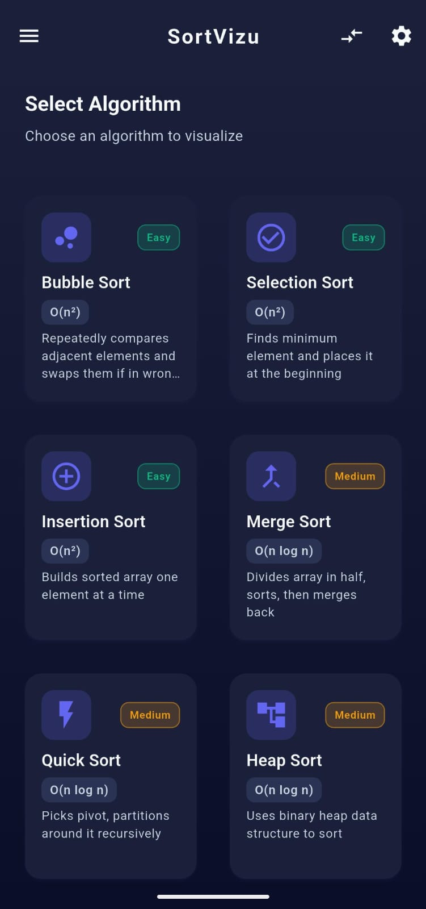
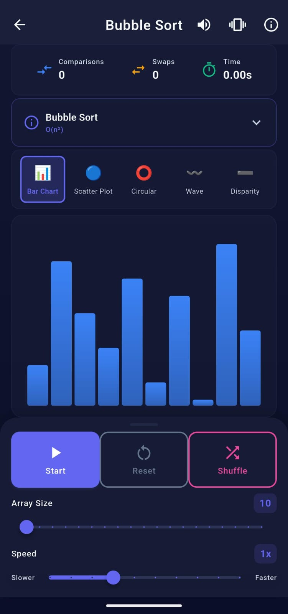
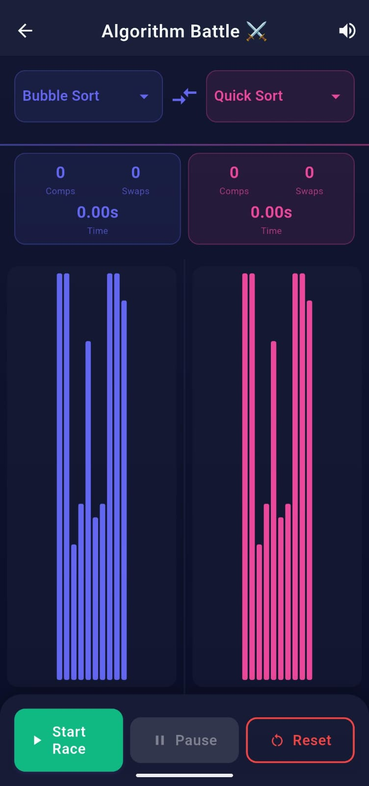
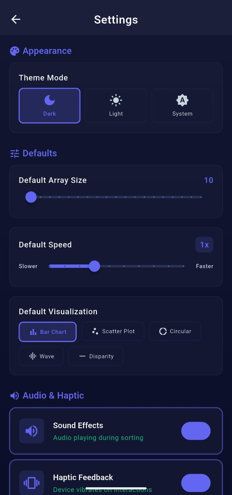

# 📊 SortVizu - Sorting Algorithm Visualizer


> **"Serious about algorithms, playful in presentation."**

**SortVizu** is a beautiful, interactive, and educational Flutter application designed to visualize how sorting algorithms work in real-time. Whether you are a Computer Science student trying to understand Quick Sort or a developer who enjoys the satisfaction of organized data, SortVizu provides a "Professional but Fun" experience.

---

## ✨ Key Features

### 🧠 Comprehensive Algorithm Library
From the basics to the complex (and the chaotic):
- **Basic:** Bubble Sort, Selection Sort, Insertion Sort.
- **Advanced:** Merge Sort, Quick Sort, Heap Sort, Radix Sort.
- **Exotic (Easter Eggs):** Bogo Sort, Stalin Sort (Unlockable!).

### ⚔️ Comparison Mode
Who is faster? Run two algorithms side-by-side in a race to see which one performs better under the same conditions.

### 🎨 Beautiful Visualizations & Themes
- **Multiple Views:** Bar Chart, Scatter Plot, Circular/Spiral, and more.
- **Deep Space Theme (Dark):** A professional, high-contrast dark mode for late-night coding sessions.
- **Clean Lab Theme (Light):** A crisp, clean light mode for clarity.
- **System Sync:** Automatically adapts to your device settings.

### 🎛️ Full Control
- **Dynamic Controls:** Adjust array size and sorting speed (0.25x to 10x) in real-time.
- **Interactive:** Pause, Resume, and Reset animations instantly.
- **Audio Feedback:** Satisfying dynamic sound effects (pitch changes based on value) and haptic feedback for a tactile experience.

### 🏆 Gamification
- Unlock hidden "Exotic" algorithms through interaction.
- Track your stats: Total sorts, fastest time, and more.

---

## 📱 Screenshots

| Home & Themes | Visualizer | Comparison Mode | Settings |
|:---:|:---:|:---:|:---:|
|  |  |  |  |

*(Note: Please upload screenshots to an `assets/screenshots` folder in your repo to display them here)*

---

## 🛠️ Tech Stack & Architecture

This project follows **Clean Architecture** principles to ensure scalability and maintainability.

- **Framework:** [Flutter](https://flutter.dev/)
- **Language:** [Dart](https://dart.dev/)
- **State Management:** [Provider](https://pub.dev/packages/provider)
- **Local Storage:** [SharedPreferences](https://pub.dev/packages/shared_preferences)
- **Audio:** [AudioPlayers](https://pub.dev/packages/audioplayers)

---

### 📂 Folder Structure

```text
    lib/
    ├── 🧮 algorithms/          # Sorting logic implementation
    │   ├── base_sort_algorithm.dart
    │   ├── bubble_sort.dart
    │   ├── quick_sort.dart
    │   └── ... (other algorithms)
    │
    ├── 🧱 core/                # App configuration & constants
    │   ├── constants/          # Colors, Strings, Sizes, Assets
    │   ├── enums/              # AlgorithmType, VisualizationType
    │   ├── services/           # Sound, Preferences, Achievement Managers
    │   ├── theme/              # App Theme (Dark/Light)
    │   └── utils/              # Helpers like SnackBar
    │
    ├── 📦 models/              # Data models
    │   ├── sort_state.dart
    │   └── achievement.dart
    │
    ├── ⚡ providers/           # State Management
    │   └── settings_provider.dart
    │
    ├── 📱 screens/             # Application Screens
    │   ├── splash_screen.dart
    │   ├── home_screen.dart
    │   ├── sorting_screen.dart
    │   ├── comparison_screen.dart
    │   └── settings_screen.dart
    │
    ├── 🧩 widgets/             # Reusable UI Components
    │   ├── control_panel.dart
    │   ├── sort_bar.dart
    │   ├── stats_display.dart
    │   └── visualizations/     # Visual rendering logic
    │       ├── circular_visualization.dart
    │       ├── scatter_plot_visualization.dart
    │       └── wave_visualization.dart
    │
    └── main.dart               # Entry point
```

---

## 🚀 Getting Started

To run this project locally, follow these steps:

### Prerequisites
- Flutter SDK installed (version 3.0.0 or higher recommended).
- An Android Emulator or Physical Device.

### Installation

1. **Clone the repository**
   ```bash
   git clone [https://github.com/GigaFdlh/SortVizu.git](https://github.com/GigaFdlh/SortVizu.git)
   cd sortvizu
    ```
2. **Install dependencies**
    ```bash
    flutter pub get
    ```
3. **Run the app**

    ```bash
    flutter run
    ```

---

## 🤝 Contributing

Contributions are what make the open-source community such an amazing place to learn, inspire, and create. Any contributions you make are **greatly appreciated**.

1. Fork the Project
2. Create your Feature Branch (`git checkout -b feature/AmazingFeature`)
3. Commit your Changes (`git commit -m 'Add some AmazingFeature'`)
4. Push to the Branch (`git push origin feature/AmazingFeature`)
5. Open a Pull Request

---

## 📝 License

Distributed under the MIT License. See `LICENSE` for more information.

---

## 👏 Acknowledgements

- Inspired by various sorting visualizers online.
- Sounds and Icons used are royalty-free or custom-made.
- Special thanks to the Flutter community for the amazing tools.

---

<p align="center">
  Made with ❤️ by <strong>[GigaFdlh]</strong>
</p>